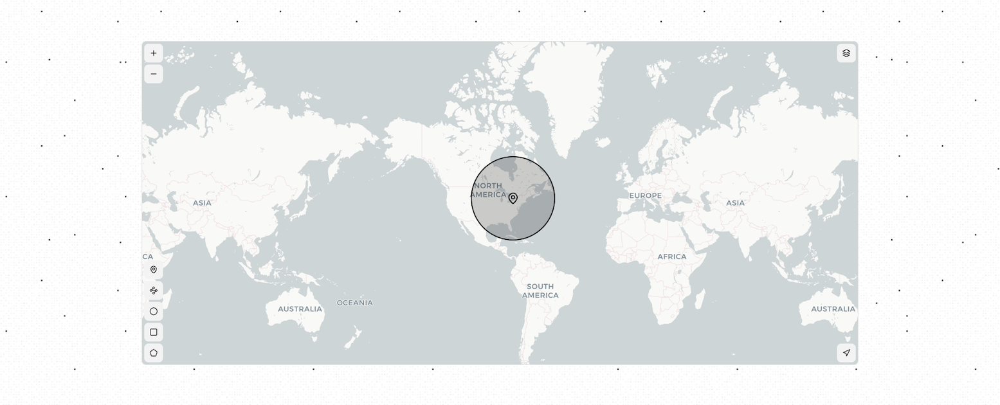

# shadcn/ui Map

A map component built with Leaflet and React Leaflet, designed to integrate with shadcn/ui.

## Documentation

Visit https://shadcn-map.vercel.app/docs to view the documentation.

## License

This project is licensed under the MIT License - see the [LICENSE](LICENSE) file for details.
